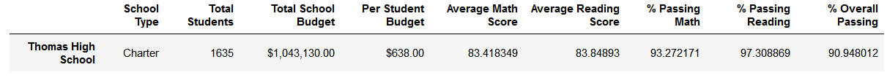

# School District Analysis

## Overview
<!-- tasked with analyzing/summarizing math and reading test results for high school students at 15 schools in a district.  After completing original analysis, scholastic dishonesty was discovered, so we had to remove all scores for 9th graders at ths, then repeat the analysis with that being accounted for. -->
We were tasked with summarizing math and reading test results for high school students in a district.  We looked at data from 15 schools with over 39,000 students total, and tabulated their results based on school, grade level, type of school, per-student budget, and school size.  After completing our initial analysis, the school board noticed scholastic dishonesty in the scores for 9th grade students from Thomas High School. Without knowing how many scores were inaccurate, we elected to remove all of the Thomas High 9th-grader's scores.  This report highlights the differences between the original and modified results.

## Results
While first instinct may lead one to remove the Thomas High School 9th graders entirely, doing so would interfere with school size and per-student budget calculations.  Instead, we used the `loc` method from Python's `Pandas` and `NumPy` libraries to replace their test scores with `nan`, meaning Not a Number. We also used `loc` to count the number of affected students, so we could calculate averages and percentages properly, without accounting for students whose scores didn't contribute to the sum.  

Overall, the differences from our initial results and the modified results were very small.  Many results appear the same in both cases, especially at higher level analyses such as *Scores by Per-Student Budget*, *Scores by School Size*, and *Scores by School Type*.  

### Effects on District Summary

The District Summary accounts for every student equally, regardless of age, school, or any other differentiators.  Our initial results are shown here:

And here are the modified results after removing the potentially dishonest scores:

The district's *overall passing percentage* went down by 0.3%, with the *percentage of students passing math* decreasing 0.2% and the *percentage of students passing reading* decreasing 0.1%.  The *average reading score* was unaffected, or affected so little it doesn't show at one digit of precision, while the *average math score* decreased by 0.1. 

### Effects on School Summary
<!-- avg math and all % passing down, avg reading up, surprisingly -->
We then broke the results down by school, though for this report we are focusing primarily on Thomas High School.  Our initial results are shown below:

The modified results are here:

Every category except for Average Reading Score decreased with the removal of dishonest scores, but the Average Reading Score increased.  This likely tells us that some of the 9th-graders had low reading scores that had a greater effect on the Average reading score than on the percent of students passing reading.  

### Effects on Relative Performance of Thomas High School
<!-- THS remained in second place overall -->
Thomas High School remained at second place in the district for students passing both reading and math, though the results for other categories did change a bit. 
- Average Math Score
  - Originally 4th in the district, dropped to 5th after removing the 9th-graders
- Average Reading Score
  - Remained 5th in the district
- % Passing Math
  - Remained 7th in the district 
- % Passing Reading
  - Originally 1st in the district, dropped to 3rd after removing the 9th-graders
  
The full statistics for each school, ordered by overall passing percentages, can be viewed [here for the original analysis](Resources/Original_Top_Schools.PNG) and [here for the modified analysis](Resources/Modified_Top_Schools.PNG), if you're interested. 

### Effects on Scores

#### Math and Reading Scores by Grade
As only the 9th-grade scores were affected by our changes, we'll focus on those results. If you are interested, however, the full results can be found with the following links: 
- [original math results](Resources/Original_Math_by_Grade.PNG)
- [original reading results](Resources/Original_Reading_by_Grade.PNG)
- [modified math results](Resources/Modified_Math_by_Grade.PNG)
- [modified reading results](Resources/Modified_Reading_by_Grade.PNG)

For Thomas High School specifically, the 9th grade results for both math and reading were functionally erased, replaced with `nan`. For all 9th-graders in the district, the original average math score was 80.4, falling to 80.1 with the removal of THS.  The original average reading score was 82.5, dropping to 82.4 with the modification.  

#### Scores by School Budget, School Size, and School Type
The results for scores based on school budget, size, and type were unaffected by the removal of THS 9th-graders.  

We divided budget into four buckets, with the schools divided as equally as possible.  THS fell into the third bucket, with a per-student budget of $631-$645.  To my surprise, schools with lower per-student spending did better in every category, with our highest budget bucket having the worst scores.

Less surprisingly, large schools with 2000+ students had worse results than small or medium schools, which were very competitive with each other.  

Charter schools fared better than district schools in every category.  While THS was a charter school, removing their 9th-graders had no effect on performance at this scale.

I found it interesting that the district summary changed, but these snapshots did not.  To ensure our updated code worked properly, I looked into more precise results and saw small changes to scores at the hundredths or thousandths places.  From that, I conclude that our rounding just happened to fall such that it rounded some district numbers down, while rounding the numbers in this section up.  

## Summary
Removing the scores of 9th-grade students from Thomas High School had a relatively small effect on the district's statistics.  The percentage of students passing both math and reading decreased by 0.3%, which is small overall but is a significant difference made by removing 461 students' scores from a list of 39,170.  Despite this difference in district results, we saw no change in the results based on school size, type, or per-student spending.  Within the district, THS remained 2nd in the district, based on the percentage of students passing both math and reading, but they fell from 1st to 3rd for percentage of students passing reading.  While the percentage of students at THS passing reading decreased, the average reading score for the school actually increased, likely due to removing a small number of significantly low scores.

Because our results didn't change too much, I find it likely that most of the scores for THS 9th-graders were reliable.  However, we can also rest assured that removing those accurate data points did not significantly skew our overall results, and we can be sure the numbers we are using are meaningful.

